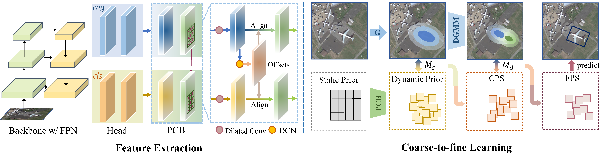

# mmrotate-dcfl
Official implementation for the CVPR23 paper: Dynamic Coarse-to-Fine Learning for Oriented Tiny Object Detection. [arxiv](https://arxiv.org/abs/2304.08876)

## Introduction
DCFL is a learning framework for detecting oriented tiny objects.



## Installation and Get Started

Required environments:
- Linux
- Python 3.7+
- PyTorch 1.10.0+
- CUDA 9.2+
- GCC 5+
- MMdet 2.23.0+
- [MMCV-DCFL](https://github.com/Chasel-Tsui/MMCV-DCFL) 


Install:
Note that this repository is based on the MMRotate. Assume that your environment has satisfied the above requirements, please follow the following steps for installation.

```
git clone https://github.com/Chasel-Tsui/mmrotate-dcfl.git
cd mmrotate-dcfl
pip install -r requirements/build.txt
python setup.py develop
```

## Main Results

DOTA-v1.0

| Method |         Backbone         | AP50  | AP75  | mAP | Angle | lr schd | Aug  | Batch Size |                           Configs                          |  
| :-----: | :----------------------: | :---: | ----- | :---: | :-----: | :--: | :-------: |:-----:| :----------------------------------------------------------: | 
|RetinaNet-O| ResNet50 (1024,1024,200) | 69.17 | 36.71 | 39.33| le135  |   1x    |  Flipping   |     2      | [retinanet_obb_r50_dota1](configs/baselines/retinanet_obb_r50_dota1.py) | 
|R3Det| ResNet50 (1024,1024,200) | 70.18 | 35.54 | 37.73| oc  |   1x    |  Flipping   |     2      | [r3det_oc_r50_dota1](configs/baselines/r3det_oc_r50_dota1.py) |
|ATSS-O| ResNet50 (1024,1024,200) | 73.12 | 43.66 | 43.04| le135  |   1x    |  Flipping   |     2      | [atss_le135_r50_dota1](configs/baselines/atss_le135_r50_dota1.py) |
|S2A-Net| ResNet50 (1024,1024,200) | 74.12 | 43.14 | 42.33| le90  |   1x    |  Flipping   |     2      | [s2a_le90_r50_dota1](configs/baselines/s2a_le90_r50_dota1.py) | 
|DCFL| ResNet50 (1024,1024,200) | **74.26** | **47.55** | **45.07** | le135  |   1x    |  Flipping   |     2      |     [dcfl_r50_dota1](configs/dcfl/dotav1_test_dcfl_r50_1x.py)      | 

DOTA-v2.0

| Method |         Backbone         | AP50  |  Angle | lr schd | Aug  | Batch Size |                           Configs                          | Speed |
| :-----: | :----------------------: | :---: | :-----: | :--: | :-------: |:-----:| :----------------------------------------------------------: | :--: |
|RetinaNet-O| ResNet50 (1024,1024,200) | 46.68 |  le135  |   1x    |  Flipping   |     2      | [retinanet_obb_r50_dota2](configs/baselines/retinanet_le135_r50_dota2.py) | 20.8 FPS|
|R3Det w/ KLD| ResNet50 (1024,1024,200) | 47.26 |  le135  |   1x    |  Flipping   |     2      | [r3det_le135_r50_dota2](configs/baselines/r3det_le135_r50_dota2.py) | 16.2 FPS |
|ATSS-O| ResNet50 (1024,1024,200) | 49.57 |  le135  |   1x    |  Flipping   |     2      | [atss_le135_r50_dota2](configs/baselines/atss_le135_r50_dota2.py) | - |
|S2A-Net| ResNet50 (1024,1024,200) | 49.86 |  le135  |   1x    |  Flipping   |     2      | [s2a_le135_r50_dota2](configs/baselines/s2a_le135_r50_dota2.py) | 18.9 FPS|
|DCFL| ResNet50 (1024,1024,200) | 51.57 | le135  |   1x    |  Flipping   |     2      |     [dcfl_r50_dota2](configs/dcfl/dotav2_test_dcfl_r50_1x.py)      | 20.9 FPS |
|DCFL| ResNet101 (1024,1024,200) | **52.54** | le135  |   1x    |  Flipping   |     2      |     [dcfl_r101_dota2](configs/dcfl/dotav2_test_dcfl_r101_1x.py)      | - |

## Visualization
Predictions of the RetinaNet-O are shown in the first row, predictions of the DCFL are shown in the second row. Note that the green box denotes the True Positive, the red box denotes the False Negative and the blue box denotes the False Positive predictions.


## Citation
If you find this work helpful, please consider citing:
```bibtex
@inproceedings{xu2023dcfl,
  title={Dynamic Coarse-to-Fine Learning for Oriented Tiny Object Detection},
  author={Xu, Chang and Ding, Jian and Wang, Jinwang and Yang, Wen and Yu, Huai and Yu, Lei and Xia, Gui-Song},
  booktitle={Proceedings of the IEEE/CVF Conference on Computer Vision and Pattern Recognition (CVPR)},
  year={2023},
```